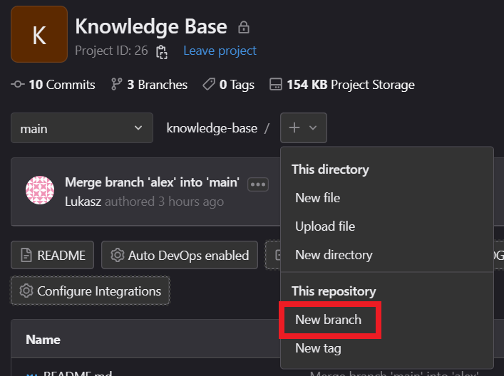
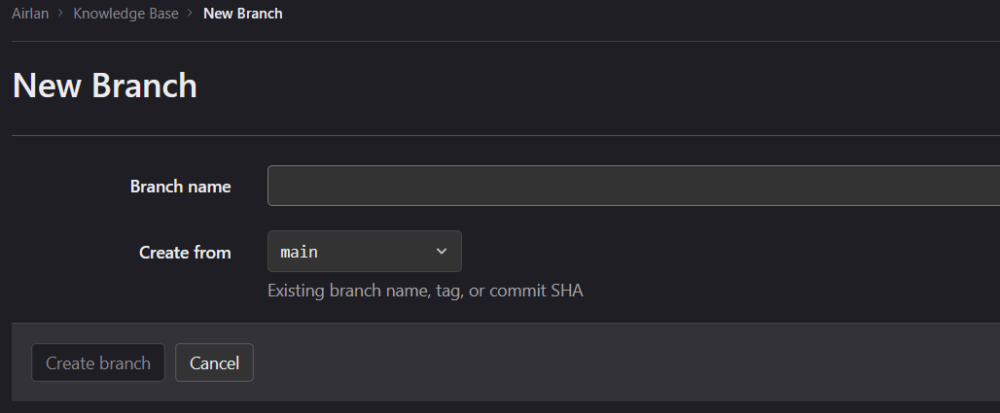
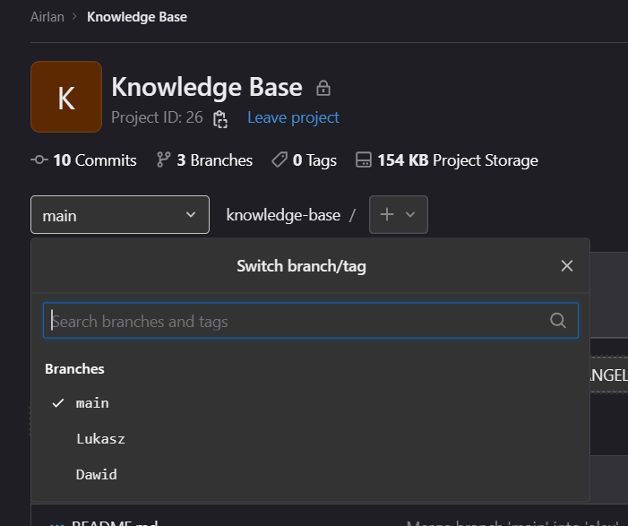

# .github


# Konwencje repozytorium Git

Kazdy branch z personalnym Knowledge Base'em bedzie merge'owany pod koniec każdego czwartku, aby każdy plik po jednym tygodniu znalazł się w branch'u main repozytorium i nie było go trzeba szukać po innych branch'ach.

Nazwa branch'a z naszym personalnym Knowledge Base'ie powinna składać się z pierwszej litery imienia i całego nazwiska **bez polskich znaków i z małych liter**, na przykład: `lkolodziej`.

# Konwencja nazewnictwa plików

## 1. Podstawowe zasady:

- Nie używamy polskich znaków.
- Unikamy używania znaków specjalnych podczas nazywania plików. Do tych znaków należą:
`/ \ " ' * ; - ? [ ] ( ) ~ ! $ { } < > # @ & | space tab newline`
- Zamiast spacji, używamy myślnika `-`.
- W nazwach plików rozróżniamy wielkie i małe litery. Oznacza to, że `PLIK`, `Plik`, `plik` są trzema różnymi nazwami plików, nawet jeśli znajdują się w tym samym katalogu.
- Daty zapisujemy w systemie `DD-MM-YYYY`. Gdzie `D`-dzień, `M`-miesiąc, `Y`-rok.
- Nazwy plików powinny być jak najbardziej opisowe i zrozumiałe.

## 2. Nazywanie katalogów głównych:

`[Nazwa firmy]-[Nazwa katalogu]`
`[Nazwa projektu]-[Nazwa katalogu]`

**Przykłady:**
`Samorzad-Dokumenty`
`Specyfikacja-Serwerow`

Jeżeli któraś nazwa jest dwu- lub więcej członowa, odzielamy je myślnikiem `-`.

## 3. Nazywanie plików, dokumentów:

`[Nazwa projektu]-[Nazwa dokumentu]-DD-MM-YYYY`
`[Nazwa dokumentu]-[Numer wersji]-DD-MM-YYYY`

Gdzie numer wersji zapisujemy jako każda kolejna cyfra po literze ‘v’

**Przykłady:**
`Praktyki-Inwetaryzacja-Serwerow-01-01-2023`
`Mapa-Sieci-v2-01-01-2023`

## 4. Nazywanie diagramów, schematów i grafik:

`Diagram-[Opis]`
`Schemat-[Opis]`
`Grafika-[Opis]`

**Przykłady:**
`Grafika-Logo-Samorzad`
`Schemat-Mapa-Sieci-01-01-2023`

# Najważniejsze komendy Git

Lista i opis najważniejszych komend Git do pracy lokalnie na komputerze nad danym repozytorium.

## Klonowanie repozytorium:

Umożliwia ono pobranie repozytorium na lokalną maszynę.

```bash
git clone <link-do-repozytorium>
```

Gdzie &lt;link-do-repozytorium&gt; to główny link do repozytorium składający się z:

```
https://git.elektryk.com.pl/samorzad/knowledge-base.git
        │                    │         │             └── rozszerzenie .git
        └── domeny           │         │
                             │         └── nazwy repozytorium
                             └── nazwy organizacji/grupy/użytkownika
```

## Wyświetlenie wszystkich branch'y:

Umożliwia ono wyświetlenie wszystkich branch'y w repozytorium. Branch, w którym obecnie są dokonywane zmiany zostanie podświetlony innym kolorem i oznaczony gwiazdką `*`.

```bash
git branch
```

> Uwaga! Polecenie to nie wyświetla innych branch'y jeżeli nie ma takiej potzreby, Dlatego czasami może być widoczny jedynie branch `main`. Można jednak bez problemu zmienić branch, w którym obecnie mają być dokonane zmiany wiedząc, że on istnieje.

## Stworzenie branch'a:

```bash
git branch <nazwa>
```

Gdzie &lt;nazwa&gt; jest nazwą branch'a.

> Uwaga! Branch o nazwie `test` i `Test` są traktowane przez Git'a jako dwa różne branch'e. Dlatego jako konwencję zaleca się tworzenie nazw branch'y **tylko z małej litery**.

### Alternatywa w GUI GitLab'a

1. Należy nacisnąć pod nazwą repozytorium na ikonkę **+** i z listy wybrać **New branch**.



2. Następnie należy w polu `Branch name` wpisać nazwę branch'a jakiego chcemy stworzyć oraz wybrać z jakiego istniejacego branch'a chemy stworzyć nowy – w polu `Create from`.



## Zmiana branch'a do pracy:

```bash
git checkout <nazwa>
```

Gdzie &lt;nazwa&gt; jest nazwą branch'a.

> Od wersji Git 2.23 możliwe jest również użycie komendy `git switch <nazwa>`. W praktyce mają one taki sam efekt i nie ma znaczenia jaka zostanie użyta.

> Uwaga! Git nie pozwoli na zmianę branch'a, jeżeli nie zostanie wykonany commit z wszystkimi pozostałymi zmianami na obecnym branch'u.

### Alternatywa w GUI GitLab'a

Należy wybrać pod nazwą repozytorium do jakiego branch'a ma zostać zmieniony widok.



## Dokonywanie zmian w repozytorium:

Po dokonaniu zmian do odpowiednich plików należy je "dodać" do Git'a, aby wiedział jakie pliki ma śledzić.

```bash
git add <nazwa-pliku>
```

Gdzie &lt;nazwa-pliku&gt; to nazwa pliku wraz z rozszerzeniem.

> Dobrą praktyką jest dodawanie każdego pliku, aby tego dokonać można – zamiast wpisywania nazwy pliku – użyć kropki `.` lub parametru `--all`.

Następnie nalezy stworzyć commit, który sygnalizuje Git'owi, że projekt uległ zmianie i jest to jego najnowsza wersja.

```bash
git commit
```

Po czym zostanie otwarty – wybrany przy instalacji Git'a – edytor tekstu. Pierwsza linijka tekstu będzie traktowana jako tytuł commit'a, a każda następna jako część jego opisu.

> Możliwe jest użycie w komendzie `commit` parametru `-m` lub `--message`, a za nim wzięty w cudzysłowie tytuł commit'u. Wpisanie opisu tą metogą **nie będzie możliwe**.

**Zaleca się tworzenie jak najbardziej deskryptywnych i opisowych nazw commit'ów** aby każdy użytkownik bo zobaczeniu jego tytułu wiedział *mniej więcej* co dana zmiana wprowadza.

Po wprowadzeniu odpowiednich zmian oraz stworzeniu odpowiadających im commit'ów można przesłać wprowadzone zmiany do zdalnego repozytorium.

```bash
git push origin <branch>
```

Gdzie &lt;branch&gt; to nazwa branch'a na którym wprowadziliśmy zmiany. Zostanie przesłany tylko on i jeżeli zostały wprowadzone zmiany w innych branch'ach to należyć wykonać push również na nie.

---

Każde z tych zadań ma swoje alternatywy w GUI GitLab'a natomiast **odradza się ich użycia**, gdyż potrafią one bardzo zbeszcześcić historię commit'ów.
